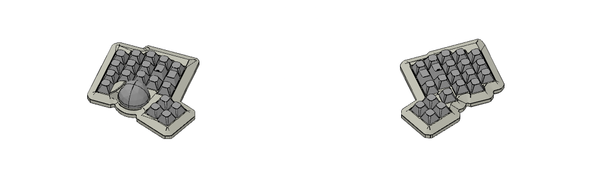
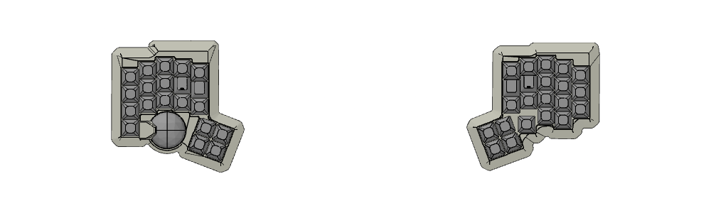

# yui01

Generated by [Auto-Keyboard-Design-Kit](https://auto-kdk.pages.dev/)

## Preview

- 3D View

- Top View

## Parts List

|Part|Quantity|
|---|---|
|wired controller|2|
|Conthrough(2.5mm, 11pin)|4|
|USB-C cable|2|
|Choc V2 switch and Choc socket|42|
|Diode|42|
|Keycap|42|

## 参考にしたリンク
*https://note.com/lyin729/n/n8e0402a9e7f6
*https://note.com/sam1dare/n/n816ce95fb2f2
*https://cornixhub.com/vial-keys
*https://get.vial.today/docs/custom_keycode.html
*https://note.com/ltksk/n/n4a5b14eb79fc
*https://blog.kiamotomonic.net/mumbojumbo/keyball-firmware/

